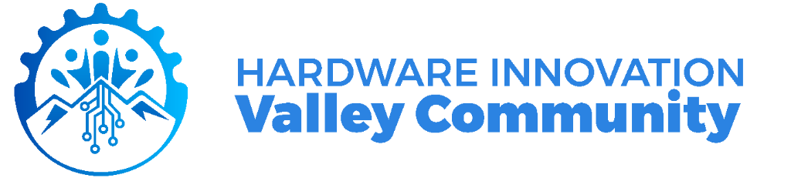

# Plastiwatch Firmware: Building a Smart Edge Activity Tracking Device

<div align="center">
  
  &nbsp;&nbsp;&nbsp;&nbsp;
  
</div>

---

## 📚 Introduction

Welcome to the **Plastiwatch** firmware development training manual. This project is designed to guide you through building a smart, edge AI-powered wearable device capable of tracking activity and detecting falls.

**The Task:**
Your goal is to develop the firmware for the Plastiwatch using the ESP32-C3 microcontroller. You will interface with sensors, manage power efficiently, and deploy machine learning models directly on the device.

This manual takes you from a **beginner's perspective** (setting up your environment) to **advanced concepts** (RTOS, Edge AI, and OTA updates).

---

## 🛠️ System Setup

Before writing code, we need to set up our development environment.

### 1. Prerequisites
*   **Hardware:**
    *   Seeed Studio XIAO ESP32C3
    *   MPU6050 (Accelerometer/Gyroscope)
    *   SSD1306 OLED Display (I2C)
    *   Haptic Motor & Button
    *   LiPo Battery
*   **Software:**
    *   [Visual Studio Code (VS Code)](https://code.visualstudio.com/)
    *   [PlatformIO IDE Extension](https://platformio.org/platformio-ide) for VS Code

### 2. Installation Steps
1.  **Install VS Code:** Download and install the version appropriate for your OS.
2.  **Install PlatformIO:**
    *   Open VS Code.
    *   Go to the Extensions view (Ctrl+Shift+X).
    *   Search for "PlatformIO IDE".
    *   Click "Install".
    *   *Tip: Wait for the installation to complete and reload VS Code if prompted.*
3.  **USB Drivers:** Ensure you have the necessary USB drivers for the ESP32-C3 (often built-in on modern OSs, but check Seeed Studio's wiki if not recognized).

---

## 🚀 Walkthrough: Getting Started

### 1. Project Initialization
This project is built using the **Arduino framework** on top of **FreeRTOS**.
*   **Clone/Open the Project:** Open the `plastiwatch_firmware` folder in VS Code.
*   **Check `platformio.ini`:** This file controls the build configuration. It specifies the board (`seeed_xiao_esp32c3`), framework, and libraries.

### 2. Building the Firmware
1.  Click the **PlatformIO Alien icon** on the left sidebar.
2.  Under **Project Tasks**, click **Build**.
3.  *Success?* You should see a "SUCCESS" message in the terminal.

### 3. Uploading to Device
1.  Connect your Plastiwatch via USB-C.
2.  Click **Upload** in the PlatformIO tasks (or the arrow icon in the bottom status bar).
3.  Wait for the writing process to reach 100%.

### 4. Serial Monitor
To see debug output:
1.  Click **Monitor** in PlatformIO tasks.
2.  Set baud rate to `115200` if not auto-detected.

---

## 🧠 Deep Dive: From Beginner to Advanced

### Level 1: The Basics (Drivers & I/O)
We start by interfacing with hardware.
*   **Display (`DisplayDriver`):** Controls the OLED screen. We use the Adafruit GFX library to draw text and shapes.
*   **IMU (`IMUDriver`):** Reads acceleration and gyroscope data from the MPU6050. This raw data is the fuel for our AI.

### Level 2: The Operating System (FreeRTOS)
Instead of a simple `loop()`, we use a **Real-Time Operating System (RTOS)**.
*   **Tasks:** Independent loops running in parallel (e.g., `SensorTask`, `UITask`).
*   **Queues:** Safe way to send data between tasks (e.g., `sensorQueue`, `uiQueue`).
*   **Event Groups:** Flags to signal system states (e.g., `EVENT_BIT_FALL_DETECTED`).

### Level 3: Edge AI (Machine Learning)
We don't just log data; we understand it.
*   **Edge Impulse:** We use a model trained on Edge Impulse to classify movements (Idle, Walking, Fall).
*   **Inference:** The model runs directly on the ESP32-C3, making predictions in real-time without needing Wi-Fi.

### Level 4: Advanced Features
*   **Deep Sleep:** To save battery, the watch sleeps when idle and wakes up on motion.
*   **OTA (Over-The-Air) Updates:** We use `ElegantOTA` to upload new firmware wirelessly via a web interface, essential for a sealed wearable.

---

## 📂 Project Structure

```
plastiwatch_firmware/
├── include/            # Header files (.h)
│   ├── drivers/        # Hardware interfaces
│   ├── managers/       # Logic controllers (Power, OTA)
│   └── system_events.h # Global events and data structures
├── src/                # Source files (.cpp)
│   ├── drivers/        # Driver implementations
│   ├── managers/       # Manager implementations
│   └── main.cpp        # Entry point & Task setup
├── platformio.ini      # Project configuration & Dependencies
└── README.md           # This manual
```

---

## 🤝 Community & Support

This project is part of the **Hardware Innovation Valley Community** training program.

*   **Questions?** Reach out to your instructor or check the community forum.
*   **Contribute:** Found a bug? Open an issue or submit a pull request!

---
*Built with ❤️ by PlastiBytes & HIVC*
